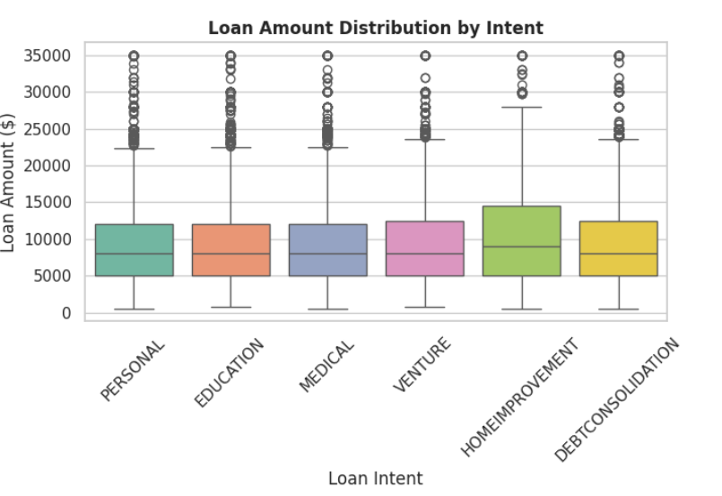
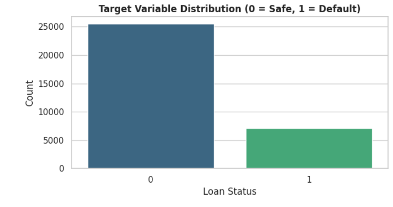
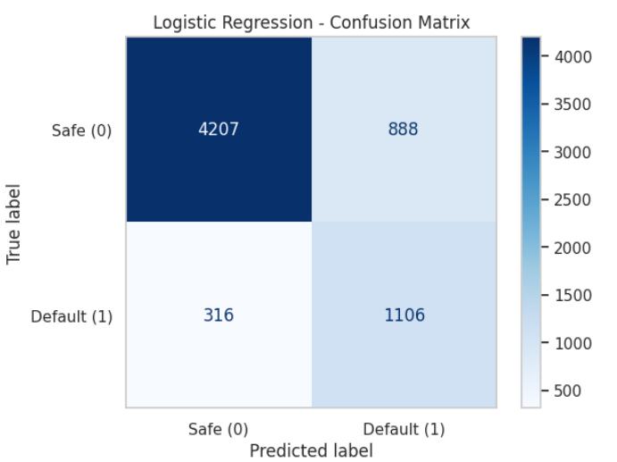
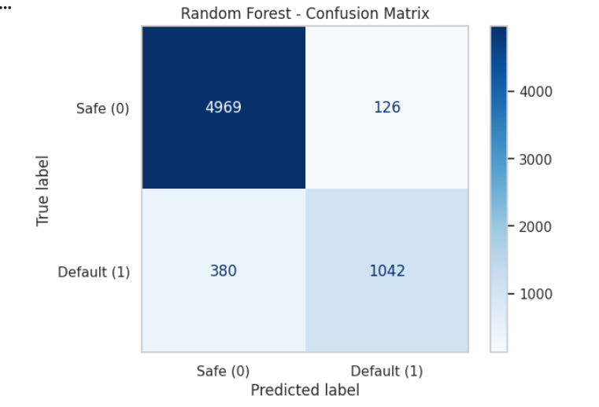
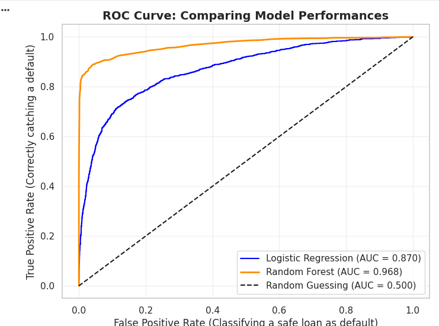
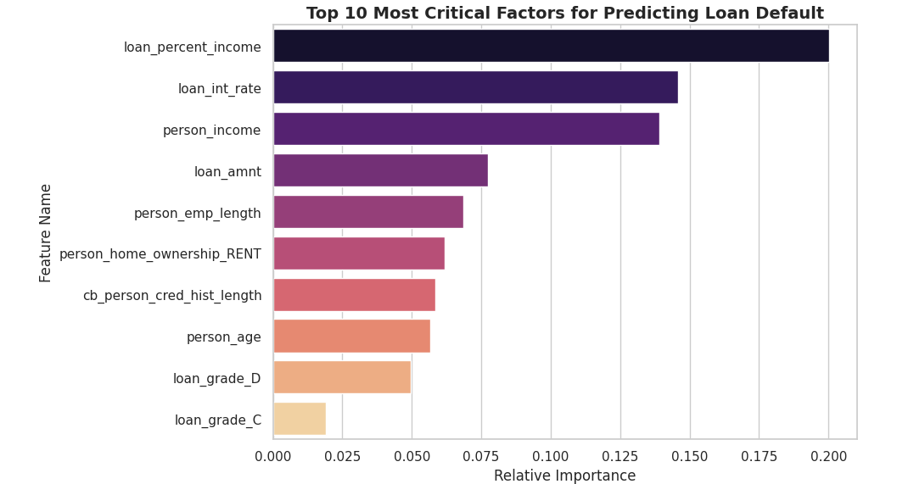

# 🏦 Credit Risk Optimization Model

## 🎯 Problem Statement
The objective of this project is to build a predictive Machine Learning model that evaluates credit risk. By analyzing various financial and demographic factors, the model predicts the likelihood of a borrower defaulting on a loan, thereby helping financial institutions optimize lending decisions and minimize losses.

## 📁 Project Structure
```text
Credit_Risk_Optimization/
│
├── data/                    # Contains the raw dataset (CSV)
├── model/                   # Contains the trained .pkl models
├── notebook/                # Jupyter Notebook with full code
├── results/                 # EDA plots and evaluation metrics
└── README.md                # Project documentation

🛠️ Tech Stack
Programming Language: Python 3.x

Data Manipulation: Pandas, NumPy

Data Visualization: Matplotlib, Seaborn

Machine Learning: Scikit-Learn (Logistic Regression, Random Forest)

Model Export: Pickle


Dataset
The dataset located in the data/ directory contains customer financial records, including features such as income, credit history, loan amount, and employment status.

⚙️ Methodology
Exploratory Data Analysis (EDA): Handled missing values, detected outliers, and visualized relationships between features to understand data distribution.

Data Preprocessing: Applied feature scaling and encoded categorical variables to prepare the data for modeling.

Model Training: Trained and evaluated two classification models: Logistic Regression and Random Forest, to find the most accurate algorithm.

Export: Both trained models were exported as .pkl files for potential deployment.


📈 Results & Visualizations
The models successfully identified high-risk customers. Below are the key visual insights and evaluation metrics from the project:

1. Data Distribution
Target Class Distribution:


Loan Status Count:


2. Model Evaluation (Confusion Matrices)
Logistic Regression Confusion Matrix:


Random Forest Confusion Matrix:


3. Performance Metrics
ROC-AUC Curve:


Feature Importance (Random Forest):
Visualizing which financial factors had the highest impact on loan default predictions.



🚀 How to Run Locally
Clone this repository:

Bash
git clone [https://github.com/rastoginavya2006/Credit_Risk_Optimization.git](https://github.com/rastoginavya2006/Credit_Risk_Optimization.git)
Navigate to the project directory.

Open the notebook/CreditRiskOptimization.ipynb file in Jupyter Notebook or Google Colab.

Run all the cells to train the models and generate the results.

The trained models will be automatically exported as .pkl files into the model/ folder.


💡 Conclusion
This project successfully demonstrates how Machine Learning can be leveraged to automate and optimize credit risk assessment. The models provided deep insights into feature importance, offering a reliable tool for risk mitigation in banking and finance.
